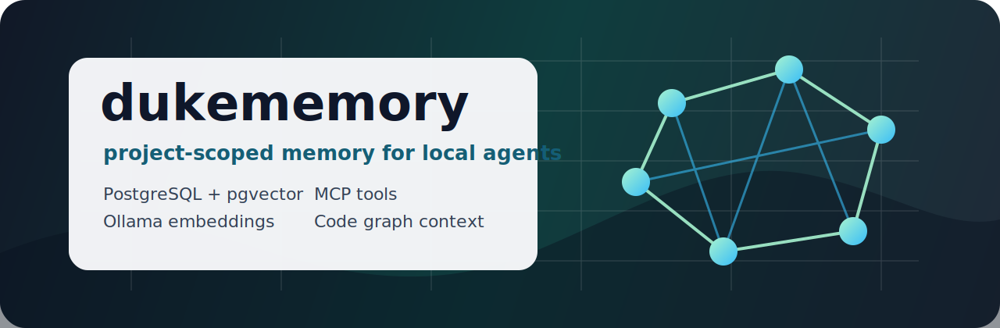

# dukememory



[English](README.md) | [Русский](README.ru.md)

[](https://github.com/dukedanya/dukememory/actions/workflows/ci.yml)
[](https://www.rust-lang.org/)
[](#mcp-server-for-ai-agents)
[](#quick-start)
[](#requirements)

**Private-by-default memory for AI coding agents: project-scoped recall,
semantic retrieval, and code context over PostgreSQL, pgvector, Ollama, and
MCP.**

Dukememory is a local-first memory layer for Codex and developer agents. It
turns decisions, architecture rules, task outcomes, code facts, and retrieval
feedback into reviewable project memory, then serves compact task context
through CLI commands and `dukememory_*` MCP tools.

It is built for developers who want persistent AI agent memory that stays local,
auditable, project-isolated, and connected to the codebase.

## Why It Exists

Most agent memory systems have the same failure modes: memory is global, hard to
audit, too easy to poison, or disconnected from code. Dukememory takes a stricter
approach:

- memory is isolated by `project_id` and defaults to the current repository;
- automatic observations start as `pending` and require review before retrieval;
- old facts are `superseded` or `archived`, not destructively overwritten;
- obvious secrets are blocked before writes;
- context packs include only task-relevant memory, graph facts, and code hits;
- every MCP tool, command, hook, event, and agent-facing API uses the
  `dukememory_*` prefix.

## Key Features

| Feature | What it does |
| --- | --- |
| AI agent memory | Stores durable project decisions, rules, setup notes, summaries, and task outcomes |
| MCP server | Exposes memory, search, code context, graph, audit, backup, eval, and maintenance tools |
| Hybrid retrieval | Combines PostgreSQL full-text search with pgvector semantic search and Reciprocal Rank Fusion |
| Local embeddings | Uses Ollama models such as `qwen3-embedding:8b` and `qwen3:14b` |
| Review workflow | Keeps agent-written memory candidates `pending` until promoted |
| Code graph context | Indexes Rust, Python, JavaScript, TypeScript, Go, Java, Kotlin, and Swift symbols |
| Memory graph | Tracks entities, facts, edges, provenance episodes, and temporal invalidation |
| Codex integration | Generates Codex MCP config and Stop/PreCompact extraction hooks |
| Native viewer | Opens a local memory/code graph browser for project vaults |

## Quick Start

```bash
git clone https://github.com/dukedanya/dukememory.git
cd dukememory

brew install postgresql@17 pgvector
scripts/dukememory_postgres.sh start
scripts/dukememory_postgres.sh migrate
export DUKEMEMORY_DATABASE_URL="$(scripts/dukememory_postgres.sh url)"

cargo run -- doctor
cargo run -- remember --kind decision "Use project_id for every memory lookup."
cargo run -- search "project memory isolation"
cargo run -- context "what should I know before editing retrieval"
```

Run the MCP server:

```bash
cargo run -- mcp
```

Generate Codex config and hooks:

```bash
cargo run -- codex-config
cargo run -- codex-hooks
```

Open the native memory viewer:

```bash
cargo run -- dukememory_app
```

## MCP Server For AI Agents

Dukememory is primarily designed as an MCP server for local coding agents. The
agent-facing tools include:

| Tool family | Examples |
| --- | --- |
| Task context | `dukememory_prepare`, `dukememory_context`, `dukememory_agent_before` |
| Memory writes | `dukememory_remember`, `dukememory_extract`, `dukememory_agent_after` |
| Review lifecycle | `dukememory_review`, `dukememory_promote`, `dukememory_supersede`, `dukememory_archive` |
| Code intelligence | `dukememory_code_search`, `dukememory_code_explore`, `dukememory_read_symbol`, `dukememory_impact` |
| Development quality | `dukememory_devsystem` |
| Graph and semantic ops | `dukememory_graph`, `dukememory_graph_extract`, `dukememory_trace`, `dukememory_feedback` |
| Operations | `dukememory_status`, `dukememory_health`, `dukememory_backup`, `dukememory_export`, `dukememory_import` |

Start non-trivial agent tasks with `dukememory_prepare` and pass
`project_path`. It incrementally refreshes the code index and returns a compact,
task-scoped context bundle instead of dumping all project memory into the prompt.

`dukememory_devsystem` runs the MCP-facing `dukedevsystem` advisory quality
loop. Its structured response includes a stable `dukedevsystem.report.v1`
contract block with capabilities and self-validation status, role/stage reports,
File Entropy Score, boundary repair plans, advisory quality gates, optional
quality evidence, and pending-only memory write candidates.

## Architecture

```text
Codex / local AI agent
        |
        | MCP tools or CLI commands
        v
dukememory
  |-- project isolation and safety policy
  |-- memory lifecycle and review queue
  |-- hybrid retrieval and context packing
  |-- code symbol index and code memories
  |-- memory graph and audit trail
        |
        +--> PostgreSQL + pgvector
        +--> Ollama embeddings and local LLM extraction
```

## Requirements

- Rust toolchain with edition 2024 support.
- PostgreSQL 17 with `pgvector`.
- Ollama for semantic embeddings, extraction, validation, and optional rerank.
- macOS or another Unix-like environment.
- Optional `rust-analyzer` for deeper Rust code analysis.

Default local model assumptions:

| Role | Default |
| --- | --- |
| Ollama base URL | `http://127.0.0.1:11435` |
| Memory embeddings | `qwen3-embedding:8b` |
| Fast code embeddings | `bge-m3` |
| Extraction and validation | `qwen3:14b` |

Keyword search, listing, review, export/import, and many operational commands
work without Ollama. Explicit semantic search requires embeddings.

## Common Use Cases

- Give Codex or another coding agent persistent project memory.
- Build a local-first RAG layer for software engineering tasks.
- Keep architecture decisions and project rules searchable by repo.
- Retrieve task-scoped context from memory, code symbols, and graph facts.
- Audit, review, promote, supersede, archive, back up, export, and import agent
  memory.
- Run local semantic search over project memory with PostgreSQL, pgvector, and
  Ollama.

## Documentation

| Document | What is inside |
| --- | --- |
| [Architecture](docs/MEMORY_ARCHITECTURE.md) | Memory lifecycle, retrieval, graph storage, MCP surfaces, safety policy, schema evolution |
| [Migrations](migrations/) | Ordered PostgreSQL schema migrations |
| [Eval suite](eval/dukememory.json) | Retrieval and behavior regression cases |
| [Scripts](scripts/) | Local PostgreSQL, Codex hook, install, and Ollama forwarding helpers |
| [LaunchAgent example](launchd/com.dukememory.tailscale-ollama-forwarder.plist) | macOS service example for local Ollama forwarding |

## Project Status

Dukememory is an early local-first system under active development. The core
PostgreSQL store, MCP server, CLI, code index, graph layer, audits, evals, and
native viewer are implemented, but APIs and schema details may change before a
stable release.

## Search Keywords

AI agent memory, Codex memory, MCP server, local-first RAG, developer agent
memory, semantic search, vector search, pgvector, PostgreSQL, Ollama embeddings,
code graph, code intelligence, project memory, long-term memory for AI agents.
