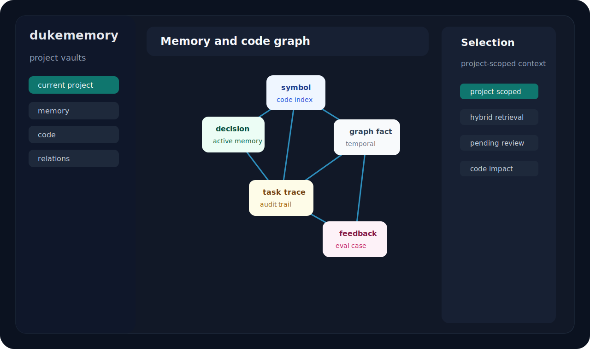

# Gallery

Visual assets for the GitHub repository and documentation.

## Project Banner

## Social Preview

Use this image as the GitHub social preview artwork:

GitHub repository settings currently require uploading social preview artwork
through the web UI. The prepared image lives at `docs/assets/social-preview.svg`.

## Native Viewer Preview

The native viewer opens a local graph browser for project-scoped memory and code
context.

